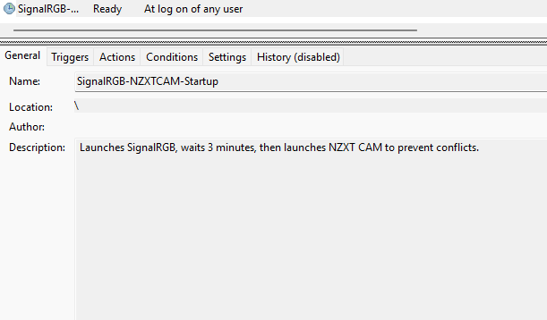

# signalrgb-nzxtcam-patcher
Patcher to allow SignalRGB and NZXT Cam to run together without conflicts.

## Features

The script performs the following steps automatically:

    Finds Installation Path: It searches for the latest version of the SignalRGB application folder to locate the correct plugin files.

    Patches Files: It modifies four specific JavaScript files (NZXT_Kraken_Elite.js, NZXT_Kraken_Elite_V2_AIO.js, Nzxt_Kraken_X3_AIO.js, and Nzxt_Kraken_Z3_AIO.js) to disable fan control support.

    Edits Registry: It sets the StartupLaunch and autoclose_conflicts values to 0 in the SignalRGB registry key.

    Deletes Autostart Entries: It removes the SignalRgb and NZXT.CAM entries from the HKEY_CURRENT_USER\Software\Microsoft\Windows\CurrentVersion\Run registry key.

    Creates Scheduled Task: It creates a scheduled task named SignalRGB-NZXTCAM-Startup that executes on user login. This task first runs SignalRGB, waits for a 3-minute delay, and then starts NZXT CAM.

## Prerequisites

1. SignalRGB and NZXT CAM must be installed. If default location is not selected, you may need to update $signalRgbPath and $nzxtCamPath

2. The user must have Administrator privileges to run the script.


## Usage

Follow these steps to run the script.

1. Download the script: Download signalrgb-nzxtcam-patcher.ps1 to a location on your computer, for example, your Downloads folder.

2. Open PowerShell as Administrator:

    a. Click the Start button.

    b. Type powershell.

    c. Right-click "Windows PowerShell" or "PowerShell" from the search results.

    d. Select "Run as administrator."

3. Run the script:

    a. In the PowerShell window, navigate to the directory where you saved the script. For example, if you saved it in your Downloads folder, type:

    b.
    ```powershell
    cd C:\downloads
    ```

    or

    ```powershell
    cd $env:USERPROFILE\Downloads
    ```

    c. Run the script using the following command to bypass the system's execution policy for this single run:

    ```powershell
    powershell.exe -ExecutionPolicy Bypass -File .\signalrgb-nzxtcam-patcher.ps1
    ```

4. Confirm Script Execution:

    a. The script will log its progress directly in the PowerShell window.

    b. Upon completion, you will see a "Script execution completed" message.

    c. You can now close the PowerShell window.

## Troubleshooting

If you encounter a System.UnauthorizedAccessException error when running the script, ensure you have opened the PowerShell window with administrator privileges as described in step 2.

## Important Notes

    This script relies on the file and registry paths of the current software versions. If a future update to SignalRGB or NZXT CAM changes these paths, the script may need to be updated.

    While the script attempts to disable autostart via the registry, it is still recommended to manually confirm that the "Start with Windows" or "Autostart" options are disabled within the settings of both applications.

## Screenshot


